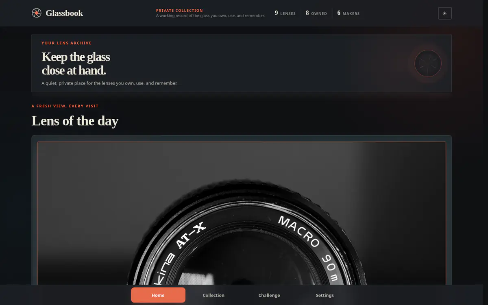
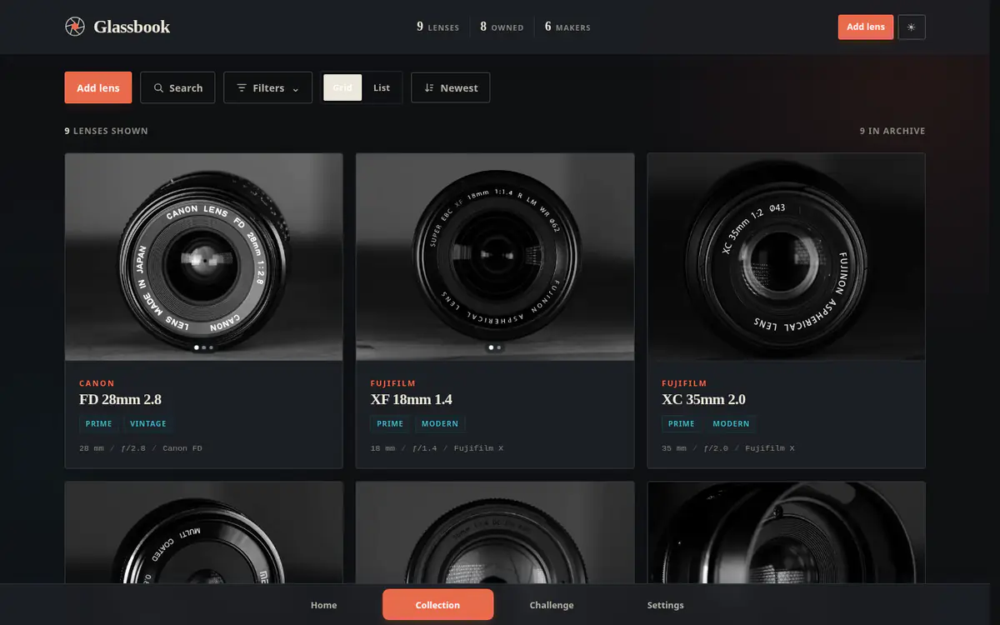
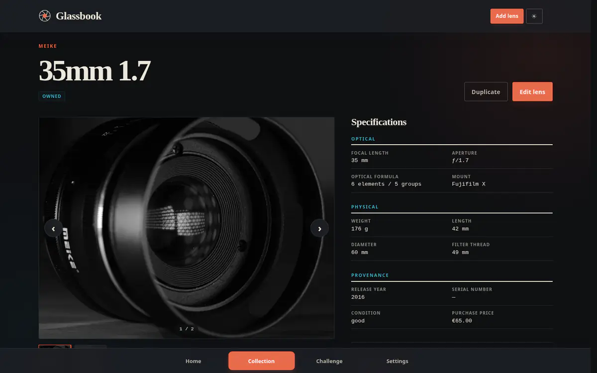
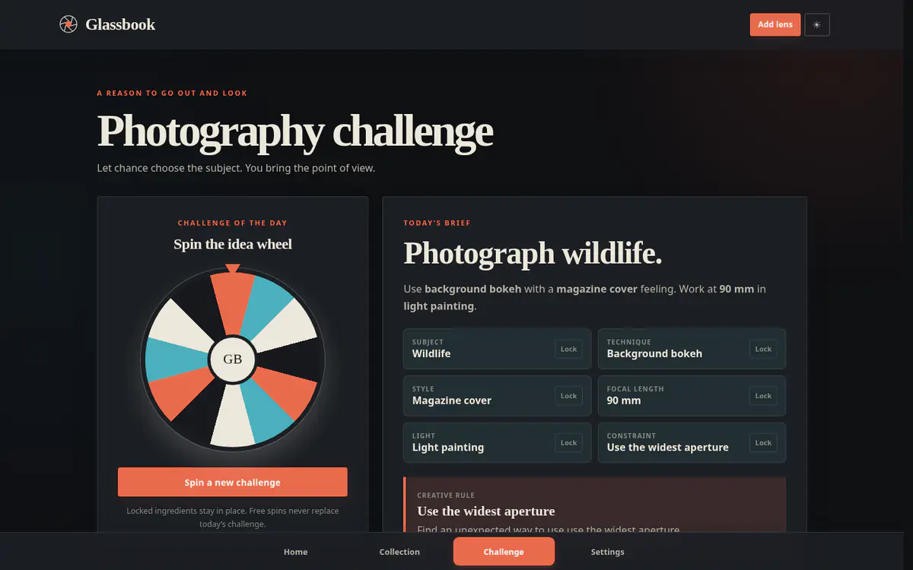
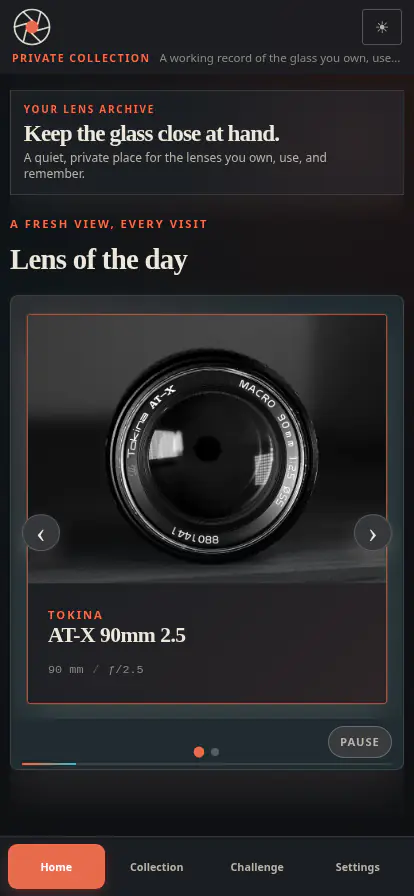
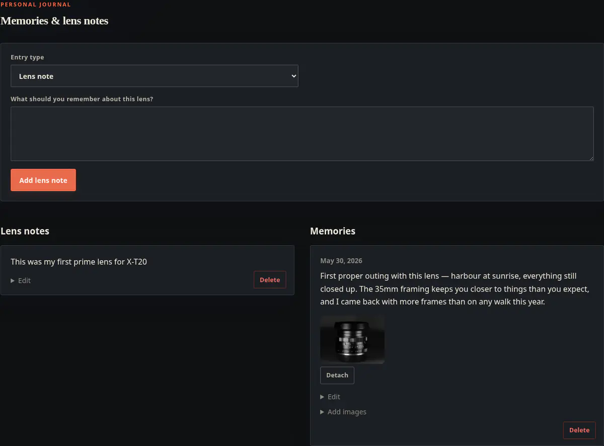

<div align="center">


# Glassbook

**A private, self-hosted home for your camera lens collection.**

[](LICENSE)


[Highlights](#highlights) · [Getting started](#getting-started) · [Features](#features) ·
[Backups](#backing-up-your-collection) · [Configuration](#configuration) ·
[Security](#security-model) · [Development](#development)

<br>



</div>

---

## Highlights

- **Yours alone.** One SQLite file plus your photos. No account, no cloud, no tracking.
- **Everything about a lens in one place.** Specifications, purchase details, condition, photos,
  notes, and dated memories.
- **Made to be browsed.** Grid or list, instant search, and filters by manufacturer, ownership, type,
  era, and focal length.
- **Lens of the day and a challenge wheel.** Rediscover what you own and get a photography assignment
  matched to your lenses.
- **Insurance-ready.** Export a customizable PDF report of the whole collection.
- **Safe to keep.** One-click backup and validated, transactional restore.
- **Runs anywhere.** `docker compose up` and you are done. Installable as a PWA on your phone.
- **Careful with your data.** Argon2id passwords, hashed sessions, a strict content
  security policy, and validated uploads.

## What is Glassbook?

If you collect camera lenses, the details live in too many places at once. The serial number is in an
old email, the price is in a spreadsheet, and whether that 50mm is the good copy or the scratched one
is somewhere in your head.

Glassbook is a small website that runs on your own computer or home server, and only you can see it.
Think of it as a notebook for your glass: every lens gets a page with its photos, its specifications,
what you paid, and the stories you attach to it. You can search it, filter it, and browse it from
your phone or laptop.

Two things make it worth opening even when you are not looking anything up:

- **Lens of the day** picks one lens from your collection each day, so you rediscover things you own.
- **The challenge wheel** invents a photography assignment — a subject, a style, a focal length — and
  tells you which of your lenses fit it.

Nothing leaves your machine. There is no account to sign up for, no company involved, and no cloud
service that can shut down and take your catalogue with it. It is yours, in a single file you can
copy to a backup drive.

**Glassbook is not** a marketplace, a public gallery, or a shared team tool. It is built for one
person and one collection.

## A look inside

|                                                              |                                                             |
| :----------------------------------------------------------: | :---------------------------------------------------------: |
|                |     |
|     **Home** — your lens of the day, chosen fresh daily      |    **Collection** — search, filter, and sort every lens     |
|             |      |
| **Lens page** — photos, full specifications, notes, memories | **Challenge** — spin an assignment, lock the parts you like |

<div align="center">
  
  <br>
  <em>The same catalogue on a phone. Install it to your home screen if you like.</em>
</div>

## Getting started

The easiest way to run Glassbook is with Docker. You will need
[Docker Desktop](https://www.docker.com/products/docker-desktop/) (Windows, macOS) or Docker Engine
with the Compose plugin (Linux). Everything else is four commands.

**1. Download Glassbook**

```sh
git clone https://github.com/bitfischer/Glassbook.git
cd Glassbook
```

**2. Turn on the login**

This step is not optional. Glassbook only asks for a password when `AUTH_ENABLED` is set to `true`.
Open `compose.yaml` in any text editor and add the highlighted line to the `environment:` block:

```yaml
services:
  glassbook:
    environment:
      AUTH_ENABLED: 'true' # <- add this line
      ORIGIN: ${ORIGIN:-}
```

> [!WARNING]
> Without this line, Glassbook serves your entire catalogue — and the backup download — to anyone who
> can reach it, with no password at all. Setting `AUTH_ENABLED` in a `.env` file does **not** work; it
> has to be in `compose.yaml`, because that is what gets passed into the container.

**3. Start it**

```sh
docker compose up --build -d
```

The first build takes a few minutes. After that it starts in seconds.

**4. Open it and pick a password**

Go to **http://localhost:7002**. Glassbook will ask you to create the one account for this
installation — choose a username and a password you will remember. There is no "forgot password"
email, so write it down somewhere safe.

That's it. Use **Add lens** to enter your first lens.

To stop Glassbook, run `docker compose down`. Your data stays put. To start it again, run
`docker compose up -d`.

> **Just want to look around first?** Skip step 2, run steps 1, 3 and 4, and Glassbook opens with no
> login at all. That is fine on a laptop that nothing else can reach — but turn the login on before
> you put it anywhere else.

### Reaching it from your phone

While the phone is on the same network as the machine running Glassbook, open
`http://<that-machine's-IP>:7002`. If you want to reach it from anywhere on the internet, read
[Putting it on the internet](#putting-it-on-the-internet) first — there are two things you must get
right.

## Features

**Your lenses**

- Add, edit, duplicate, and delete lens records.
- Record manufacturer, model, mount, serial number, focal range, apertures, optical formula,
  dimensions, weight, filter thread, release year, purchase details, condition, ownership, currency,
  and notes.
- Track lenses you own, have sold, want (wishlist), or have borrowed.
- Upload JPEG, PNG, or WebP photos, pick a cover, reorder them, and remove them.

**Finding things**

- Browse as a grid or a list, with multi-photo cards.
- Quick-search by manufacturer or model.
- Filter by manufacturer, ownership, lens type, era, and focal length.
- Sort by catalogue fields or by date added.

**Coming back to it**

- A persistent, non-repeating lens of the day.
- Timeless notes plus dated memories, with memory photos folded into the lens gallery.
- A photography challenge wheel with a large idea catalogue. Lock the ingredients you like, reroll
  the rest, and see which of your owned lenses cover the suggested focal length.

**Housekeeping**

- Maintain reusable manufacturer and mount values from Settings.
- Export a customizable PDF insurance report for the full lens catalogue.
- Download a complete backup, or restore one, from Settings.
- Install it as a Progressive Web App from a supporting browser.
- Light or dark appearance, on desktop and mobile.
- Liveness and readiness endpoints for monitoring.

### Notes and memories

A lens is more than its specifications, so every lens page carries a small journal. It holds two
kinds of writing, side by side.

A **lens note** is timeless — the things you keep having to look up. Which body it pairs with, that
the filter thread is an unusual size, that the focus ring could use a service. It stays true no
matter when you read it.

A **memory** is dated — a walk you took, a trip it came along on, the day you finally got the shot.
Memories can carry their own photos, and those photos are folded straight into the lens's gallery.
The lens page ends up showing both the glass itself and what you did with it.



Both kinds are written from the same short form at the top of the journal, and either can be edited
or deleted later. Nothing is required — a lens with no journal at all is perfectly normal.

## Backing up your collection

**Do this regularly.** Your catalogue lives on one machine, and Glassbook is not a backup service.

While signed in, open **Settings → Download backup**. You get a single `.tar.gz` file containing a
consistent snapshot of the database and every original photo you uploaded. Copy it somewhere that is
not the server — an external drive, another computer, wherever you keep things safe.

Generated thumbnails and gallery images are deliberately left out; Glassbook rebuilds them from the
originals when needed. Deployment configuration and secrets are not included either.

To put a backup back, use **Settings → Restore backup** and pick the file. Glassbook validates the
archive, checks every referenced photo, and swaps the catalogue over in one transaction, rolling back
if anything fails. The login data in the backup wins, so you may need to sign in again with the
password you had when the backup was taken.

> [!CAUTION]
> Restoring **replaces** your current catalogue. Download a fresh backup first if there is anything in
> there you want to keep.

For the most complete recovery point, stop Glassbook and copy the whole `glassbook-data` Docker volume
or `DATA_DIR`. Never copy the data directory of a _running_ instance — SQLite's write-ahead log can
make a file-level copy inconsistent.

## Putting it on the internet

Everything above assumes a machine on your own network. Exposing Glassbook to the internet needs two
things done right.

**1. Turn on the login.** See [step 2](#getting-started). Do not skip it.

**2. Set `ORIGIN` and terminate HTTPS at a reverse proxy.** Create a `.env` file next to
`compose.yaml` with the exact URL you will type into the browser:

```dotenv
ORIGIN=https://glassbook.example.com
```

`ORIGIN` drives SvelteKit's origin checks, and an `https://` value is what switches session cookies to
secure. The scheme, hostname, and any non-default port must match the real URL exactly, or logging in
will fail with a cross-site error.

The supplied Compose configuration trusts `x-forwarded-host` and `x-forwarded-proto`, so your proxy
must preserve the host and send those headers. Caddy, for example:

```caddyfile
glassbook.example.com {
    reverse_proxy 127.0.0.1:7002
}
```

Point DNS at the server, allow HTTPS through the firewall, and keep port `7002` restricted to the host
or a trusted network so nobody can bypass the proxy. Then check it:

```sh
curl --fail https://glassbook.example.com/healthz
curl --fail https://glassbook.example.com/readyz
```

`/healthz` reports process liveness; `/readyz` also verifies SQLite access. Both are unauthenticated
by design and expose no catalogue contents.

### Updating

```sh
git pull --ff-only
docker compose up --build -d
```

Download a backup first. The named volume is reused, and pending database migrations run
automatically at startup. Review release changes before deploying, especially to the schema, image
handling, or runtime configuration.

## Configuration

| Variable              | Default         | Purpose                                                                      |
| --------------------- | --------------- | ---------------------------------------------------------------------------- |
| `AUTH_ENABLED`        | `false`         | **Set to `true` to require a login.** Anything else leaves Glassbook open    |
| `ORIGIN`              | unset           | Exact browser-facing origin; an `https://` value enables secure cookies      |
| `PORT`                | `3000`          | Production HTTP port                                                         |
| `HOST`                | `0.0.0.0`       | Production bind address                                                      |
| `DATA_DIR`            | `./data`        | SQLite database, image directories, and temporary backup snapshots           |
| `BODY_SIZE_LIMIT`     | adapter default | Total request-body limit; keep it above `MAX_RESTORE_MB` for restore uploads |
| `MAX_UPLOAD_MB`       | `15`            | Maximum source-image size in MiB                                             |
| `MAX_PHOTOS_PER_LENS` | `10`            | Maximum number of photos stored for one lens                                 |
| `MAX_RESTORE_MB`      | `1024`          | Maximum compressed and expanded backup size accepted by Settings             |
| `SESSION_DAYS`        | `30`            | Login session lifetime in days                                               |
| `DEFAULT_CURRENCY`    | `EUR`           | Three-letter currency prefilled for new records                              |
| `PROTOCOL_HEADER`     | unset           | Reverse-proxy header carrying the original protocol                          |
| `HOST_HEADER`         | unset           | Reverse-proxy header carrying the original host                              |
| `TZ`                  | system value    | Runtime timezone used by Node and container processes                        |

The Docker image sets `DATA_DIR=/data`, `BODY_SIZE_LIMIT=1G`, `HOST=0.0.0.0`, and `PORT=3000`.
`compose.yaml` adds the proxy headers, `DEFAULT_CURRENCY=EUR`, `MAX_RESTORE_MB=1024`, and
`TZ=Europe/Berlin`.

Only variables listed in the `environment:` block of `compose.yaml` reach the container. A `.env` file
is read by Docker Compose for substitution, so it works for `ORIGIN` (which is wired up as
`${ORIGIN:-}`) but not for variables that are not referenced there.

## Security model

Found a vulnerability? Please read [SECURITY.md](SECURITY.md) and report it privately.

- Glassbook supports exactly one local account.
- **Authentication is off unless `AUTH_ENABLED=true` is set.** With it unset, every catalogue page,
  image, settings action, and the backup download is served to any unauthenticated request.
- Passwords are hashed with Argon2id.
- Session tokens are random, hashed before storage, and sent in `HttpOnly`, `SameSite=Strict` cookies.
  Cookies are marked secure when `ORIGIN` uses HTTPS.
- Backup restoration rejects unexpected paths and entry types, caps compressed and expanded size, and
  validates database integrity, schema compatibility, relationships, and referenced originals.
- Security headers include a restrictive content security policy, frame protection, a same-origin
  referrer policy, and MIME-sniffing protection.
- Uploads are decoded and validated as JPEG, PNG, or WebP before derivatives are generated.

There is no email-based password reset, second account, role system, or built-in TLS termination.
Protect the host, keep backups off the server, and use HTTPS before exposing Glassbook beyond a
trusted network.

The PWA caches only application assets and a connection-status page. Catalogue pages, images, and form
submissions are network-only, so your collection is not left behind in the service-worker cache after
logout. Installing Glassbook does **not** make the catalogue available offline.

## How your data is stored

Local development keeps state under `./data`. The container stores the same structure under `/data` in
the `glassbook-data` volume:

```text
data/
├── glassbook.db   # users, sessions, catalogue records, and image metadata
├── originals/     # uploaded source files, kept unchanged
├── gallery/       # generated display-size WebP images
├── thumbnails/    # generated card thumbnails
└── backups/       # temporary snapshots while a backup is streamed
```

SQLite runs in WAL mode with foreign keys enabled. Committed Drizzle migrations run automatically and
transactionally at startup, before the application serves requests. New installations start with an
empty catalogue.

Alongside each original, Glassbook generates an orientation-corrected WebP gallery image up to
1800 × 1800 and a 640 × 480 WebP thumbnail. The database and image files are private user data and must
never be committed to Git.

## Development

Requires Node.js 24 or newer and npm.

```sh
git clone https://github.com/bitfischer/Glassbook.git
cd Glassbook
npm install
npm run dev
```

Open `http://localhost:5173`. Note that `npm run dev` leaves authentication **off** unless you start it
with `AUTH_ENABLED=true npm run dev`. With auth on, the first visit redirects to `/setup` to create the
account.

| Command                           | Purpose                                                       |
| --------------------------------- | ------------------------------------------------------------- |
| `npm run dev`                     | Start the Vite development server                             |
| `npm run check`                   | Synchronize SvelteKit and run Svelte/TypeScript diagnostics   |
| `npm run lint`                    | Check formatting and ESLint rules                             |
| `npm run format`                  | Format the repository with Prettier                           |
| `npm test`                        | Run the Vitest suite                                          |
| `npm run test:unit`               | Run unit tests under `tests/unit`                             |
| `npm run test:e2e`                | Run Playwright tests when end-to-end tests are present        |
| `npm run build`                   | Create the production Node build                              |
| `npm run preview`                 | Preview a production build locally                            |
| `npm run start`                   | Run the built Node application                                |
| `npm run db:generate`             | Generate a migration after changing the Drizzle schema        |
| `npm run headers:sync`            | Sync licence headers with the version in `package.json`       |
| `npm run images:rebuild`          | Recreate missing gallery images and thumbnails from originals |
| `node scripts/optimize-brand.mjs` | Regenerate optimized UI and PWA brand assets                  |

`make build`, `make up`, and `make stop` are shortcuts for the Docker Compose equivalents.

After changing `src/lib/server/db/schema.ts`, run `npm run db:generate`, review the generated SQL under
`drizzle/`, and commit the migration together with the schema change. Startup applies all pending
migrations and stops with an error if one fails.

### Repository layout

```text
src/routes/          SvelteKit pages, form actions, and HTTP endpoints
src/lib/components/  Shared Svelte UI components
src/lib/domain.ts    Form validation and domain helpers
src/lib/server/      Authentication, catalogue, image, and persistence code
src/lib/server/db/   SQLite schema and migration initialization
static/              Manifest, offline page, icons, and brand assets
docs/screenshots/    Images used by this README
tests/unit/          Vitest unit tests
scripts/             Brand asset generation and maintenance scripts
```

The source logo is `Glassbook_Logo.png` (palette-optimized to about 120 KB); generated brand assets live under `static/brand/` and
`static/icons/`.

### Tech stack

| Area             | Technology                                                           |
| ---------------- | -------------------------------------------------------------------- |
| Application      | Svelte 5, SvelteKit, TypeScript                                      |
| Server runtime   | Node.js 24, SvelteKit Node adapter                                   |
| Database         | SQLite in WAL mode, `better-sqlite3`, Drizzle schema definitions     |
| Validation       | Zod                                                                  |
| Authentication   | Argon2id password hashes and hashed server-side session tokens       |
| Image processing | Sharp                                                                |
| PWA              | Web app manifest and native SvelteKit service worker                 |
| Testing          | Vitest; Playwright dependency and script for future end-to-end tests |
| Quality tooling  | `svelte-check`, ESLint, Prettier                                     |
| Deployment       | Multi-stage Docker image and Docker Compose                          |

No external database, object store, cache, or authentication provider is required.

## Running without Docker

```sh
npm ci
npm run build
NODE_ENV=production \
  AUTH_ENABLED=true \
  DATA_DIR=/srv/glassbook/data \
  ORIGIN=https://glassbook.example.com \
  HOST=127.0.0.1 \
  PORT=3000 \
  PROTOCOL_HEADER=x-forwarded-proto \
  HOST_HEADER=x-forwarded-host \
  npm run start
```

Run it under a supervisor such as systemd, make sure the service account can write to `DATA_DIR`, and
put an HTTPS reverse proxy in front of `127.0.0.1:3000`. Back up the data directory independently of
the source.

### Manual restore

1. Stop Glassbook.
2. Keep a copy of the current volume or data directory.
3. Extract the archive.
4. Put `glassbook.db` at the root of `DATA_DIR` and the image files under `originals/`.
5. Make sure the runtime user can read and write every restored file. The container runs as UID 1000.
6. Rebuild the derived images:

   ```sh
   DATA_DIR=/path/to/data npm run images:rebuild
   ```

   Or, with the Compose service stopped:

   ```sh
   docker compose run --rm --no-deps glassbook npm run images:rebuild
   ```

7. Start Glassbook and confirm `/readyz` succeeds. Anything the rebuild missed is regenerated on first
   request.

Legacy uncompressed `.tar` backups are still accepted. The adapter request limit must be larger than
`MAX_RESTORE_MB`; the supplied Docker configuration sets both to 1 GiB.

## Limitations

- Run one Glassbook instance against one data directory. SQLite and local image storage are not
  designed here for multiple replicas sharing the same files.
- Installing the PWA does not make the catalogue available offline.
- There is no password reset. Lose the password, and you restore from a backup or start over.

## License

Copyright 2026 bitfischer.de

Licensed under the [MIT License](LICENSE). You are free to use, modify, and distribute Glassbook,
including commercially, as long as the copyright and license notice stay with the software. It is
provided "as is", without warranty of any kind.

Every source file carries a short header with its author, version, and `@license MIT`. The
`@version` line is generated from `package.json`, so a release only needs the version bumped there
followed by `npm run headers:sync`. `npm run lint` fails if any header has drifted.
